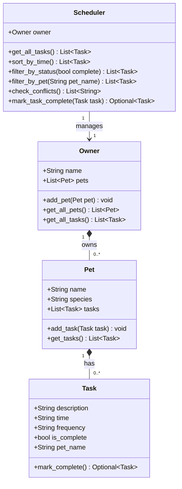

# PawPal+ Final UML Diagram

```mermaid
classDiagram
    class Task {
        +String description
        +String time
        +String frequency
        +bool is_complete
        +String pet_name
        +mark_complete() Optional~Task~
    }

    class Pet {
        +String name
        +String species
        +List~Task~ tasks
        +add_task(Task task) void
        +get_tasks() List~Task~
    }

    class Owner {
        +String name
        +List~Pet~ pets
        +add_pet(Pet pet) void
        +get_all_pets() List~Pet~
        +get_all_tasks() List~Task~
    }

    class Scheduler {
        +Owner owner
        +get_all_tasks() List~Task~
        +sort_by_time() List~Task~
        +filter_by_status(bool complete) List~Task~
        +filter_by_pet(String pet_name) List~Task~
        +check_conflicts() List~String~
        +mark_task_complete(Task task) Optional~Task~
    }

    Owner "1" *-- "0..*" Pet : owns
    Pet "1" *-- "0..*" Task : has
    Scheduler "1" --> "1" Owner : manages
```
